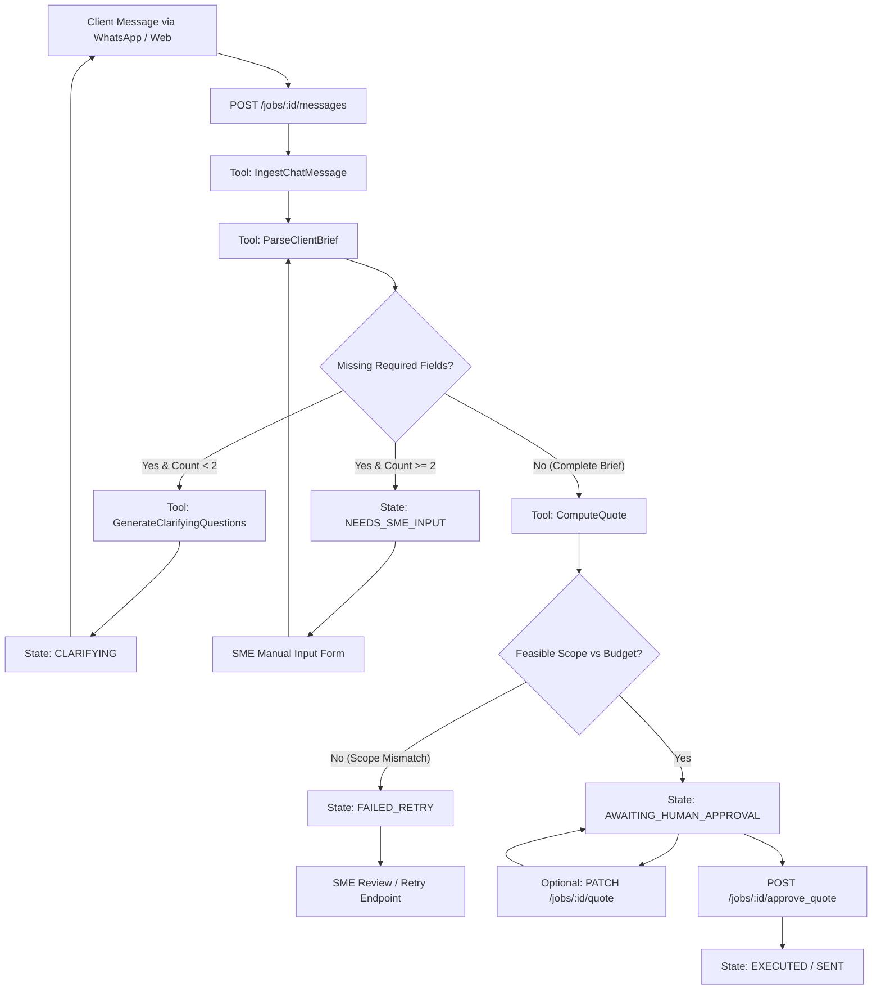

# BillAm Agent — System Overview & Architecture Guide for Product Management

**Prepared for:** Product Manager & Technical Leads  
**Document Purpose:** Comprehensive overview of the implemented backend architecture, AI agent reasoning loop, live E2E test results, and REST API capabilities to facilitate product alignment and frontend-backend integration.  
**Version:** 1.0 (MVP Verified)  
**Status:** 100% Passing Unit & Integration Suite (71/71 Tests), Live E2E Validated with Claude 3.5 Sonnet

---

## 1. System Mission & Core Value Proposition

**BillAm Agent** is an autonomous AI quoting, brief-extraction, and clarification engine tailored specifically for Nigerian micro and small enterprises (MSMEs). 

It solves the **"quoting bottleneck"** where SME owners lose leads on WhatsApp and Instagram because they cannot manually calculate custom line-item quotes or follow up on vague messages quickly.

### Key Guarantees Enforced in Code:
1. **Never Send a Quote Without Human Approval (Mandatory HITL Gate):** The agent autonomously parses briefs, asks clarifying questions, and computes quotes, but **stops at `AWAITING_HUMAN_APPROVAL`**. Only an authenticated SME action can transition a job to `EXECUTED` / `SENT`.
2. **Context-Aware Brief Extraction:** Extracts key fields (`event_type`, `guest_count`, `event_date`, `venue_location`, `budget_range`) from unstructured, messy Nigerian messages (mixed Pidgin, typos, volunteered info).
3. **Guardrails & Safeguards:** Refuses infeasible or malicious budget requests (e.g. 500 guests for ₦150k), applies rush fee contingencies for dates within 7 days, and caps clarification rounds to prevent endless loops.

---

## 2. End-to-End Agent Architecture



---

## 3. The 8 States of the BillAm State Machine

The backend state machine (`src/state/stateMachine.ts`) strictly governs every job lifecycle. Invalid transitions are blocked with HTTP `409 Conflict`.

| State | Who is in Control? | Description | Next Possible States |
| :--- | :--- | :--- | :--- |
| **`IDLE`** | System | Job created session initialized for a specific business. | `INGESTING` |
| **`INGESTING`** | System | Message received, validated, and appended to transcript. | `REASONING` |
| **`REASONING`** | AI Agent | LLM parses the brief and decides whether to clarify or compute quote. | `CLARIFYING`, `AWAITING_HUMAN_APPROVAL`, `NEEDS_SME_INPUT`, `FAILED_RETRY` |
| **`CLARIFYING`** | Client | Clarifying question was generated and sent; waiting for client reply. | `INGESTING` |
| **`NEEDS_SME_INPUT`** | SME Owner | Client failed to answer after 2 rounds; escalated to SME dashboard. | `REASONING` (after manual input) |
| **`AWAITING_HUMAN_APPROVAL`** | SME Owner | Draft quote generated with pricing; waiting for SME to review, edit, or approve. | `EXECUTED`, `IDLE` |
| **`EXECUTED`** | System | SME approved quote; quote dispatched to client. | `IDLE` |
| **`FAILED_RETRY`** | SME Owner | Infeasible request or unrecoverable error; requires SME review. | `INGESTING`, `REASONING`, `IDLE` |

---

## 4. The 4 Live Verified E2E Scenarios (Tested Live)

During backend integration testing with Claude 3.5 Sonnet, 4 distinct real-world scenarios were verified:

### Scenario 1: Happy Path Wedding (Complete Brief)
* **Client Brief:** *"Good afternoon! I'm planning my daughter's wedding, we're expecting about 150 guests. It'll hold on the 14th of next month, outdoors at our family compound in Lekki. Budget is around 3 million naira, we want it done nicely but not over the top."*
* **Behavior:** All 5 required fields are present. Clarification is skipped.
* **Result:** Real quote calculated: **₦1,926,650** (line items: Decor, Chairs/Tables, Lighting, 8% Transport logistics, 5% fuel buffer).
* **Final State:** `AWAITING_HUMAN_APPROVAL` $\rightarrow$ Approved by SME $\rightarrow$ `EXECUTED`.

### Scenario 2: Vague Pidgin Brief (Clarification Flow)
* **Client Message 1:** *"Hello good day, I dey plan small baby shower for my sister. Budget is around 300k, venue na for Ikeja hall last weekend of next month."*
* **Behavior:** Agent detects `guest_count` is missing.
* **Result:** State transitions to `CLARIFYING`. Generates a polite, natural question asking for guest count.
* **Client Message 2:** *"Ah sorry, forgot to mention - it's for about 40 people."*
* **Final State:** Brief completed $\rightarrow$ transitions to `AWAITING_HUMAN_APPROVAL` with calculated quote.

### Scenario 3: Corporate Launch (Quote Revision Flow)
* **Client Brief:** *"Hello, we are planning our corporate product launch event for around 80 attendees in Victoria Island on the 2nd Friday of next month. Budget is around 500k."*
* **Result:** Quote generated: **₦349,170**.
* **SME Action:** SME uses `PATCH /jobs/:id/quote` to adjust line items (e.g. stage backdrop and chairs) and adds note *"Applied negotiated corporate client discount"*.
* **Final State:** SME approves edited quote $\rightarrow$ transitions to `EXECUTED`.

### Scenario 4: Infeasible / Malicious Budget (Safeguard Refusal Flow)
* **Client Brief:** *"I want a full wedding setup for 500 guests, premium decor, live band, the works. Date is in 10 days. My budget is 150k total though, that's all I have, please make it work."*
* **Safeguard Enforcement:** The system checks scope vs. realistic vendor unit costs. It refuses to produce a normal quote or compress pricing dangerously.
* **Final State:** Transitions to `FAILED_RETRY` with `quote: null` and an explicit error explanation: *"Budget of ₦150,000 is severely insufficient for a 500-guest full wedding setup."*

---

## 5. Available REST API Endpoints

The backend runs on **`http://localhost:3001`** (or configured `PORT`) and exposes interactive Swagger documentation at **`http://localhost:3001/api-docs`**.

### 1. `POST /jobs`
* **Purpose:** Create a new job session for a business.
* **Request Body:**
  ```json
  {
    "business_id": "biz_vendor_001",
    "business_type": "event_vendor"
  }
  ```
* **Response (201 Created):**
  ```json
  {
    "success": true,
    "data": {
      "job_id": "94e616a2-d394-4b7a-9a77-67894fdc8402",
      "state": "IDLE",
      "created_at": "2026-09-02T12:00:00.000Z"
    }
  }
  ```

### 2. `POST /jobs/:id/messages`
* **Purpose:** Send client message and trigger AI reasoning loop.
* **Request Body:**
  ```json
  {
    "message_text": "Good day, I need decor for 150 guests in Lekki on Nov 20th, budget 2m.",
    "received_at": "2026-09-02T12:00:00.000Z"
  }
  ```
* **Response (200 OK):** Returns full updated `Job` object containing state, extracted fields, and draft quote (if ready).

### 3. `GET /jobs/:id`
* **Purpose:** Fetch full job details, messages transcript, extracted fields, and audit state.

### 4. `GET /jobs/:id/quote`
* **Purpose:** Retrieve generated quote (line items, contingencies, subtotal, and total).

### 5. `PATCH /jobs/:id/quote`
* **Purpose:** SME modifies line items or notes before approving.
* **Request Body:**
  ```json
  {
    "line_items": [
      { "name": "Chairs & Tables", "quantity": 150, "unit_price": 600, "total": 90000 }
    ],
    "notes": "Applied 10% direct discount"
  }
  ```

### 6. `POST /jobs/:id/approve_quote`
* **Purpose:** SME approves quote; triggers dispatch to client.
* **Request Body:** `{ "approved_by": "sme_owner_david" }`
* **Response (200 OK):** `{ "success": true, "data": { "state": "EXECUTED", "quote_status": "SENT" } }`

### 7. `GET /jobs/:id/missing_fields`
* **Purpose:** Fetch list of missing fields when job is in `NEEDS_SME_INPUT`.

### 8. `POST /jobs/:id/manual_input`
* **Purpose:** SME supplies missing details manually and re-triggers reasoning.
* **Request Body:**
  ```json
  {
    "supplied_fields": { "guest_count": 150, "event_date": "2026-11-20" },
    "source": "SME obtained details directly via phone call"
  }
  ```

### 9. `POST /jobs/:id/retry`
* **Purpose:** Retry failed job from `FAILED_RETRY`.

---

## 6. Business Knowledge Base Configuration

The quoting math and required fields are driven by domain knowledge bases in `src/data/knowledge_base/`:
* **`event_vendor.json`** (Current MVP active domain):
  - Required fields: `event_type`, `guest_count`, `event_date`, `venue_location`, `budget_range`.
  - Pricing tiers: `budget` (<₦500k), `standard` (₦500k–₦2m), `premium` (>₦2m).
  - Logistics rules: Mainland-to-Island transport contingency (8%), fuel price contingency (5%), rush fee (15% if $\le 7$ days).
* **`caterer.json`** & **`tailor.json`** (Configured for future phases).

---

## 7. Product Manager Checklist for Integration Brief

To align the frontend with this verified backend, the PM brief should instruct the frontend team to:

1. **Replace Mock State Types with Backend `JobState`:**
   Map UI status pills to `IDLE`, `INGESTING`, `REASONING`, `CLARIFYING`, `NEEDS_SME_INPUT`, `AWAITING_HUMAN_APPROVAL`, `EXECUTED`, `FAILED_RETRY`.
2. **Standardize Data Models:**
   - Use `name`, `quantity`, `unit_price`, and `total` for quote line items.
   - Use `sender` (`client` | `agent` | `sme`) and `timestamp` (ISO string) for chat messages.
   - Use numeric values for calculations and format to Currency (`₦`) only at the UI display layer.
3. **Connect Interactive Components to Endpoints:**
   - `ChatPanel` $\rightarrow$ `POST /jobs/:id/messages`
   - `QuoteCard` / `ApprovalModal` $\rightarrow$ `POST /jobs/:id/approve_quote`
   - `QuoteEditor` $\rightarrow$ `PATCH /jobs/:id/quote`
   - `ResolveModal` $\rightarrow$ `POST /jobs/:id/manual_input`
   - `ReviewIssueModal` $\rightarrow$ `POST /jobs/:id/retry`
4. **Scope Initial UI Persona to Event Vendor:**
   Set default business type to `event_vendor` to showcase the full live quoting intelligence.
